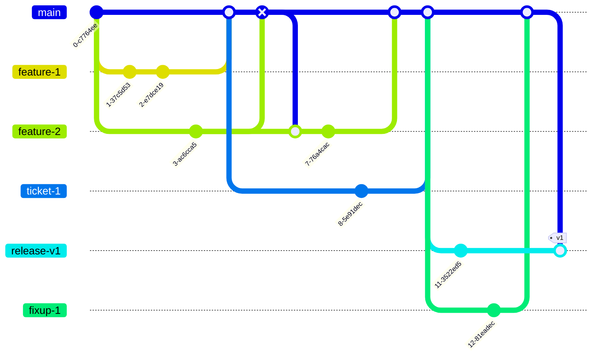

# Repository Management

### Unstable Main

Summary:
- All branches start from main
- All branches are merged to main with review and must merge with no conflicts
- Releases branched from master
- QA happens on release branch

